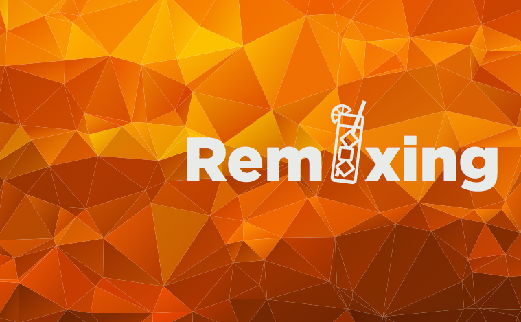

# Remixing

Remixingは株式会社リッチメディア発のスキルのレベルアップを目指しているすべてのWeb開発に携わる人たちのための勉強会です。

## Remixingの特徴

- 1セッション30分: セッションは1つのトピックにフォーカス。
- 休憩時間を長く: スピーカーに直接質問、ほかの参加者とネットワーキングする時間を長めに。もちろん休んでもOK。
- 興味のあるセッションのみ参加OK: 限りある時間を上手に活用してください。
- 3ヶ月に1回の開催を予定しており、フロントエンド、サーバサイド、iOS/Androidアプリ開発などWeb開発に関わるトピックを幅広くカバーします。